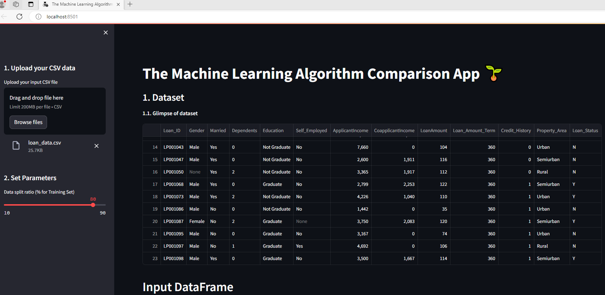
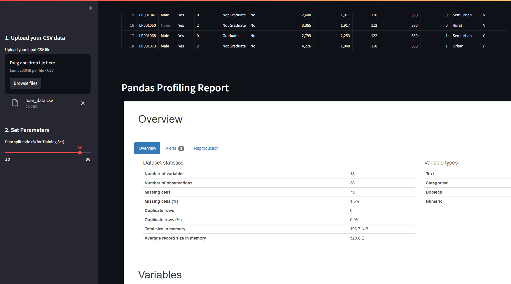
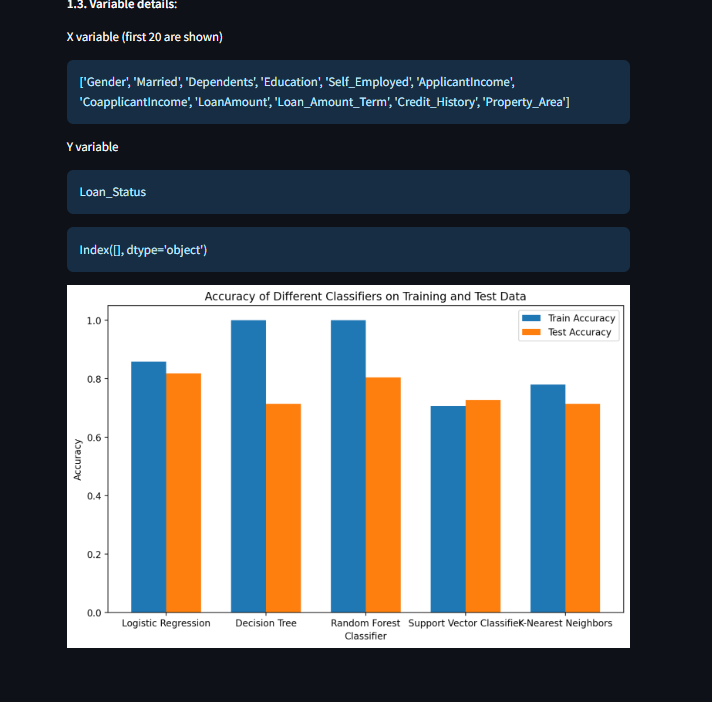

# Ml-auto-app

# Workflow

-- Upload your data
-- Analyze your data using profile
-- Train your data using differnt ratio from the sidebar


# Preprocessing
 -- There are 75 missing values with different category
 - Imputation has been done by analyzing the category type and the impact
 - Convert categorical to one hot encoded 


# Training

-- Compare your model accuracy
-- Then save the final model

# Demo

Launch the web app:


# Reproducing this web app
To recreate this web app on your own computer, do the following.

### Create conda environment

conda activate lazypredict
```
### Install prerequisite libraries

Download requirements.txt file

```

```

Pip install libraries
```
pip install -r requirements.txt
```


###  Launch the app
Run loan_app.py
```
streamlit run loan_app.py
```




